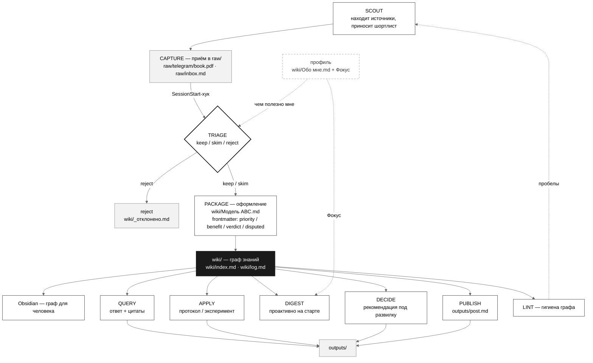
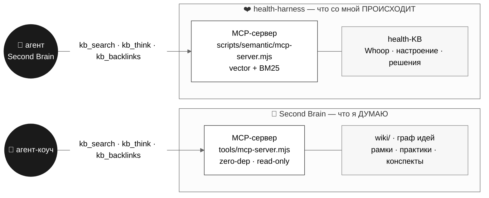

# 🧠 Second Brain

**База знаний, которую ведёт AI-агент.** Кидаешь что угодно — статью, PDF, скрин, мысль — и получаешь оформленную, оценённую и связанную с остальным страницу. Это не архив, а рабочий инструмент: отвечает на вопросы *твоими же* выверенными знаниями, превращает их в конкретное действие и — через связку со вторым агентом, знающим твоё состояние — **спорит с твоей рамкой, а не поддакивает**.

Построена по паттерну [LLM Knowledge Base Андрея Карпаты](https://gist.github.com/karpathy/442a6bf555914893e9891c11519de94f). Открывается как **Obsidian vault**. Приватный git-репозиторий.

> ⚠️ **Единственный источник — эта папка: `~/Desktop/second-brain`.**
> Ровно один локальный vault, и он же пушится на GitHub (`origin` → `github.com/cryptoyoginya/second-brain`). Никаких копий в других местах: если где-то ещё встретилась папка `second-brain` (например в `~/Documents/GitHub/`) — это не источник, открывать в Obsidian и редактировать нужно **только** эту. Поток один: правишь здесь → `git push` на GitHub.

### Суть

Большинство вторых мозгов умирают за неделю: *вносить и оформлять* превращается в работу, а на выходе — свалка, которую страшно открыть. Этот жив, потому что убирает **три трения, на которых умирают остальные** (таблица ниже), и оставляет человеку только то, что он делает лучше машины: курировать, спрашивать, решать.

Опора не на мотивацию, а на **механику знания**:
- **внешняя память** разгружает рабочую — думать можно о смысле, а не о хранении (externalized cognition);
- **связи + повторное всплытие** держат знание живым, а не мёртвым архивом (retrieval, spaced resurfacing);
- **петля знание → действие → состояние** закрывает разрыв между «знаю» и «делаю» — и, соединяя базу с данными о теле и психике, выходит на [**double-loop learning**](https://en.wikipedia.org/wiki/Double-loop_learning): система ставит под вопрос саму рамку, а не советует «стараться сильнее».

Скепсис уместен к любой системе. Эта видится рабочей не потому, что красивая, а потому что снимает труд и меняет поведение — проверяемо.

> Философия: the human's job is to curate sources, direct the analysis, ask good questions, and think about what it all means. The LLM's job is everything else 🙏

---

## Зачем: три фрикции второго мозга

Любой «второй мозг» (Notion, Obsidian, Roam…) убивает желание им пользоваться. Система снимает все фрикции (которые есть у меня):

| # | Фрикция | Что обычно происходит | Как решаем |
|---|---------|------------------------|------------|
| 1 | **Вносить данные** | лень оформлять → копится свалка | приём без трения, любой формат |
| 2 | **Оформлять** | ручная разметка/теги/связи изматывают | агент оформляет сам |
| 3 | **Анализировать** | база есть, пользы нет | встроенные триаж + критика + Query |

### 1. Вносить — приём без трения
Кидаешь что угодно, оформление не твоя забота:
- **файлы** → в `raw/`: `pdf`, текст, `html`, `epub`, **скриншоты**, **видео**, **аудио**;
- **ссылки и мысли** → строкой в `raw/inbox.md` или прямо в чат агенту.

### 2. Оформлять — агент делает сам
Читает источник целиком (PDF — текст-слоем, картинки — зрением, ссылки — фетчем) и сам:
превращает один источник в 5–15 связанных страниц живым языком, проставляет `[[ссылки]]` (граф в
Obsidian), ведёт каталог `wiki/index.md` и журнал `wiki/log.md`.

### 3. Анализировать — курирование и критика встроены
- **Триаж**: каждому источнику вердикт `keep` / `skim` / `reject` по профилю `wiki/Обо мне` (шлак не разворачивается — логируется в `wiki/_отклонено.md`).
- **Критика**: спорное помечается `> [!warning] Спорно` и `disputed: true`.
- **Оценка пользы** во frontmatter: `priority` (1–5), `benefit` (интеллект / практика / дух).
- **Query**: вопрос → синтез ответа по накопленному, с цитатами и связями.

---

## Как работает пайплайн



Скачать схему: [PNG](assets/pipeline.png) · [SVG](assets/pipeline.svg) (векторный, для печати/больших размеров). Исходник — [`assets/pipeline.mmd`](assets/pipeline.mmd).

Пайплайн: **scout → capture → triage → package → [query · apply · digest · decide · publish] → lint**.
- **Scout:** сам приношу разноформатные источники (статьи, эссе, книги, видео, лекции, сайты) под профиль и текущую рамку; ты выбираешь.
- **Query:** задаёшь вопрос → ответ из твоих знаний со ссылками на страницы.
- **Apply:** превращаю знание в протокол/эксперимент, который запускаешь сегодня.
- **Digest:** состояние-осознанный, двухконтурный — соединяю твоё состояние (health-kb) с рамками из базы и говорю то, чего сама не сформулировала ([см. ниже](#-два-мозга-знания--состояние)).
- **Decide:** на развилке собираю рекомендацию из базы со ссылками и помечаю спорное.
- **Publish:** собираю черновик поста/треда/карусели; публикуешь сама.
- **Lint:** чищу граф: противоречия, страницы-сироты, пробелы.

Система **подстраивается под твой «Фокус»**: ручной список «что важно сейчас» (правишь когда угодно) перевешивает долгосрочные интересы; авто-наблюдения только подсказывают.

---

## 🧠 × ❤️ Два мозга через MCP

Один мозг знает, что я **думаю** (эта база знаний). Второй — агент-коуч [`harness-health-engineering`](https://github.com/cryptoyoginya/harness-health-engineering) — знает, что со мной **происходит**: сон, восстановление (Whoop), настроение, решения. По отдельности каждый слеп на половину картины. Соединённые — делают то, что ни один не может в одиночку.

Связь построена на **MCP (Model Context Protocol)** — открытом протоколе, по которому агент получает доступ к внешним данным как к обычным инструментам. Связка **двусторонняя и симметричная**: каждый мозг поднимает свой MCP-сервер, а агент-визави подключает его и читает чужую базу.



### Как работает MCP здесь

Каждый мозг = локальный **stdio-сервер** (процесс Node, общение по JSON-RPC через stdin/stdout — без сети, без БД, zero-config). Агент объявляет сервер один раз, и его функции появляются как тулы с префиксом `mcp__<имя>__*`.

**Два сервера, симметрично:**

| Сервер | Файл | Кто поднимает | Кто вызывает | Индекс |
|---|---|---|---|---|
| **second-brain** | [`tools/mcp-server.mjs`](tools/mcp-server.mjs) — zero-dep Node, read-only | этот репо | агент-коуч | полнотекст по `wiki/**` (~55 стр. — хватает) |
| **health-kb** | `health-harness/scripts/semantic/mcp-server.mjs` | коуч | агент этой базы | семантика (vector + BM25 + RRF) |

**Три тула (у обоих одинаковые по смыслу):**
- **`kb_search`** — поиск по vault (титул + текст + frontmatter, фильтры `priority/verdict/domain`).
- **`kb_think`** — синтез с цитатами: собирает top-K релевантных страниц в каркас ответа.
- **`kb_backlinks`** — кто ссылается на страницу через `[[вики-ссылку]]` (обратные связи графа).

### Что даёт связка: дайджест как зеркало рамки

Главный плод — дайджест, который не советует по методу, а **ставит под вопрос саму рамку** ([double-loop learning](https://en.wikipedia.org/wiki/Double-loop_learning), Аргирис–Шён). Он берёт **улики поведения** из `health-kb` и сверяет с **рамками** (страницы с тегом `рамка`) и целями из [`Обо мне`](wiki/Обо%20мне.md):

> ❌ **Single-loop** (банально): «3-й день красного recovery — ты устала, отдохни».
>
> ✅ **Double-loop**: «3-й красный день подряд, но по решениям ты каждый раз дожимала спринт. Это не про "мало отдыхаешь" — это правило *«нельзя не доделать»*. Твоя же страница [«Транс неполноценности»](wiki/Транс%20неполноценности.md): гонка "стать достаточно хорошей" и есть ловушка. **Вопрос: в чьей логике этот срок "нельзя сдвинуть"?** Выбор: сдать ценой 4-го красного дня / сдвинуть и проверить экспериментом».

**Поток данных (5 шагов):** `kb_search` в health-kb за ~3–7 дней (состояние + тренд) → якоря рамки (`рамка` + цели) → детектор улик (расхождение поведение×рамка) → double-loop-вывод → приватность. Симметрично коуч через `kb_search` этой базы цитирует мои знания в своих рекомендациях.

**Правила:** лезет в рамку **только по уликам** и говорит **прямо, без смягчения**; корреляции («делай больше X») — не payload (это single-loop); проактивно — на старте сессии + позже по расписанию.

### Подключение (local scope — приватно)

```bash
# в этом репо: агент видит состояние
claude mcp add --scope local health-kb -- \
  node ~/Documents/GitHub/health-harness/scripts/semantic/mcp-server.mjs

# у коуча: агент видит знания
claude mcp add --scope local second-brain -- \
  node ~/Desktop/second-brain/tools/mcp-server.mjs
```

`--scope local` пишет конфиг в `~/.claude.json` для конкретного проекта — **не** в коммитимый `.mcp.json`. Проверка: `claude mcp list` → `✔ Connected`. Тулы появляются после старта сессии.

### Граница приватности (жёстко, симметрично)

- Каждый сервер отдаёт **только свою** KB; зона `.context/` не индексируется и наружу не отдаётся.
- Контент из чужого мозга живёт **локально** (в ответе / `.context/`, gitignored) — **не пишется** в свою вики и **не коммитится**.
- Наружу / в публичные места — не реплицируется.

Полный дизайн-док — [`docs/superpowers/specs/2026-07-03-state-aware-digest-design.md`](docs/superpowers/specs/2026-07-03-state-aware-digest-design.md).

---

## Сценарии использования (user stories)

Главные истории:

- **Кидаю что угодно** (pdf / текст / скрин / видео / ссылку) — оформление не моя забота *(capture)*
- **Шлак не засоряет базу** — агент отсекает, спорное помечает *(triage)*
- **Источник сам становится связными страницами** с оценкой пользы *(package)*
- **Спрашиваю — отвечает моими знаниями** с цитатами *(query)*
- **Знание → протокол/эксперимент**, который я запускаю *(apply)*
- **Дайджест приходит сам** под мои цели + 1 шаг, поднимает забытое *(digest)*
- **Развилка → рекомендация из базы** со спорным *(decide)*
- **Агент сам приносит крутые источники** на изучение *(scout)*
- **Из базы — черновик поста/треда/карусели** под публикацию *(publish)*
- **Подстраивается под «Фокус»** — ручной приоритет, меняешь когда угодно; авто только подсказывает

Полный список с ролями и «зачем» — в [USER-STORIES.md](./USER-STORIES.md).

---

## Архитектура: 3 слоя

| Слой | Назначение | Кто пишет | Правило |
|------|-----------|-----------|---------|
| `raw/` | сырые источники | человек | **неизменяемо** (тяжёлые бинарники — локально, не в git) |
| `wiki/` | вики связанных идей | агент | агент владеет полностью; точка входа — `index.md` |
| `outputs/` | отчёты, ответы | агент | можно вернуть в `wiki/` |

**Автоматизация:** `SessionStart`-хук `.claude/hooks/ingest-scan.sh` при каждом старте сканирует
`raw/`, находит источники без страниц в `wiki/` и ставит агенту задачу. Запускать ingest вручную не нужно.

---

## Стек

Намеренно простой и переносимый — никакого вендор-лока, вся база это папка с `.md`.

| Компонент | Что это | Роль | Почему так |
|-----------|---------|------|------------|
| **Markdown + Git** | плоский текст + версионирование | формат хранения вики | переносимо; версии, дифы и откат бесплатно; база читается чем угодно |
| **Obsidian** | локальный редактор + граф | как человек читает знания | local-first; `[[ссылки]]` рисуют граф; frontmatter виден как Properties |
| **Claude Code** | агентный CLI (Opus 4.8) | строит и курирует: ingest, index/log, хук-автоматизация | агент с доступом к файлам и шеллу реально пишет вики, а не только советует |
| **Claude (зрение+текст)** | LLM | читает источники, рассуждает, пишет страницы | синтез и связи между идеями; скриншоты читает напрямую зрением |
| **PyPDF2** | извлечение текста из PDF | текст-слой книг для ingest | лёгкая зависимость, работает с локальным Python |
| **MCP (health-kb)** | мост к агенту-коучу | состояние тела/психики → в Digest/Decide/Apply | знание встречается с реальным состоянием; данные приватны, живут локально |
| **YAML frontmatter** | метаданные страниц | `priority / benefit / verdict / disputed` + `type / domain` | курирование машинно-читаемо и видно в Obsidian |

---

## Темы

Диапазон открыт и постоянно растёт — продукт, AI, наука и longevity, психология, искусство,
восточные учения и далеко за их пределами. Каждый источник становится связным кустом страниц с
оценкой пользы.

Живой каталог тем — [`wiki/index.md`](./wiki/index.md), профиль владельца —
[`wiki/Обо мне.md`](./wiki/Обо%20мне.md). Конвенции и схема для агента — в [CLAUDE.md](./CLAUDE.md).
