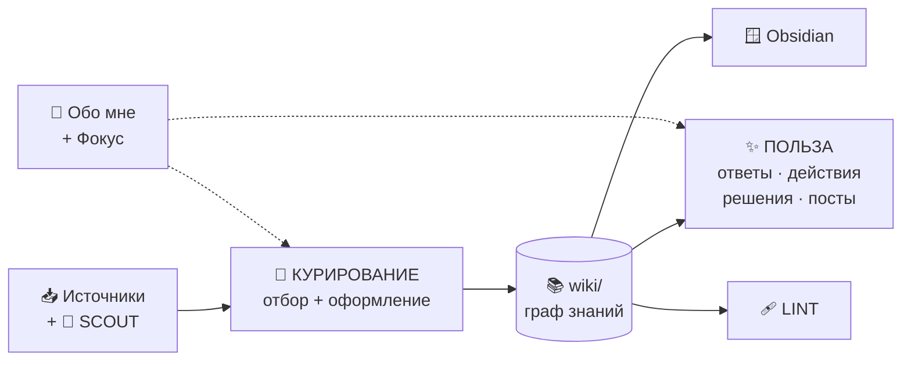
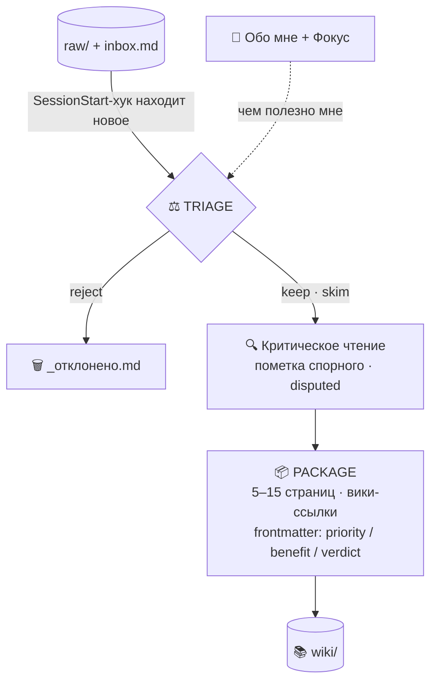
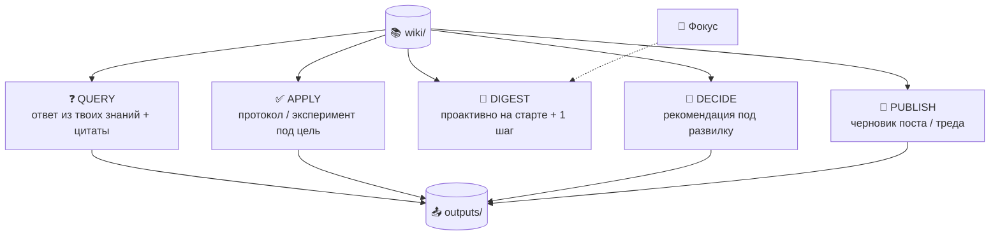

# 🧠 Second Brain

Персональная база знаний, которую **строит и курирует AI-агент**. Растущая
вики связанных идей: кидаешь что угодно — получаешь оформленные, оценённые и связанные между собой
страницы. Построена по паттерну [LLM Knowledge Base Андрея Карпаты](https://gist.github.com/karpathy/442a6bf555914893e9891c11519de94f).

Открывается как **Obsidian vault**. Приватный репозиторий.

> Философия: the human's job is to curate sources, direct the analysis, ask good questions, and think about what it all means. The LLM's job is everything else 🙏

---

## Зачем: три фрикции второго мозга

Любой «второй мозг» (Notion, Obsidian, Roam…) убивают три барьера. Система снимает все три:

| # | Фрикция | Что обычно происходит | Как решаем |
|---|---------|------------------------|------------|
| 1 | **Вносить данные** | лень оформлять → копится свалка | приём без трения, любой формат |
| 2 | **Оформлять** | ручная разметка/теги/связи изматывают | агент оформляет сам |
| 3 | **Анализировать** | база есть, пользы нет | встроенные триаж + критика + Query |

### 1. Вносить — приём без трения
Кидаешь что угодно, оформление не твоя забота:
- **файлы** → в `raw/`: `pdf`, текст, `html`, `epub`, **скриншоты**, **видео**, **аудио**;
- **ссылки и мысли** → строкой в `raw/inbox.md` или прямо в чат агенту.

### 2. Оформлять — агент делает сам
Читает источник целиком (PDF — текст-слоем, картинки — зрением, ссылки — фетчем) и сам:
превращает один источник в 5–15 связанных страниц живым языком, проставляет `[[ссылки]]` (граф в
Obsidian), ведёт каталог `wiki/index.md` и журнал `wiki/log.md`.

### 3. Анализировать — курирование и критика встроены
- **Триаж**: каждому источнику вердикт `keep` / `skim` / `reject` по профилю `wiki/Обо мне` (шлак не разворачивается — логируется в `wiki/_отклонено.md`).
- **Критика**: спорное помечается `> [!warning] Спорно` и `disputed: true`.
- **Оценка пользы** во frontmatter: `priority` (1–5), `benefit` (интеллект / практика / дух).
- **Query**: вопрос → синтез ответа по накопленному, с цитатами и связями.

---

## Как работает пайплайн

**Общая картина:**

🧹 Детали: курирование (приём → триаж → оформление)

✨ Детали: польза — payoff-операции

Полный пайплайн агента: **scout → capture → triage → package → [query · apply · digest · decide · publish] → lint**.
Анализ — **действие, ответ или решение под цель**:
- **Scout** — сам нахожу крутые источники под профиль и приношу шортлист;
- **Query** — спрашиваешь → ответ из твоих знаний с цитатами;
- **Apply** — знание превращаем протокол/эксперимент, который запускаешь;
- **Digest** — выжимка под цели + 1 шаг; **приходит сам на старте сессии** (проактивно), поднимает забытое;
- **Decide** — рекомендация из базы;
- **Publish** — из базы делаем черновик поста/треда/карусели (ты ревьюишь и постишь);
- **Lint** — гигиена графа (противоречия, сироты, пробелы).

Система **подстраивается под твой «Фокус»**: ручной список «что важно сейчас» (правишь когда угодно) перевешивает долгосрочные интересы; авто-наблюдения только подсказывают.

---

## Сценарии использования (user stories)

Главные истории:

- **Кидаю что угодно** (pdf / текст / скрин / видео / ссылку) — оформление не моя забота *(capture)*
- **Шлак не засоряет базу** — агент отсекает, спорное помечает *(triage)*
- **Источник сам становится связными страницами** с оценкой пользы *(package)*
- **Спрашиваю — отвечает моими знаниями** с цитатами *(query)*
- **Знание → протокол/эксперимент**, который я запускаю *(apply)*
- **Дайджест приходит сам** под мои цели + 1 шаг, поднимает забытое *(digest)*
- **Развилка → рекомендация из базы** со спорным *(decide)*
- **Агент сам приносит крутые источники** на изучение *(scout)*
- **Из базы — черновик поста/треда/карусели** под публикацию *(publish)*
- **Подстраивается под «Фокус»** — ручной приоритет, меняешь когда угодно; авто только подсказывает

Полный список с ролями и «зачем» — в [USER-STORIES.md](./USER-STORIES.md).

---

## Архитектура: 3 слоя

| Слой | Назначение | Кто пишет | Правило |
|------|-----------|-----------|---------|
| `raw/` | сырые источники | человек | **неизменяемо** (тяжёлые бинарники — локально, не в git) |
| `wiki/` | вики связанных идей | агент | агент владеет полностью; точка входа — `index.md` |
| `outputs/` | отчёты, ответы | агент | можно вернуть в `wiki/` |

**Автоматизация:** `SessionStart`-хук `.claude/hooks/ingest-scan.sh` при каждом старте сканирует
`raw/`, находит источники без страниц в `wiki/` и ставит агенту задачу. Запускать ingest вручную не нужно.

---

## Стек

Намеренно простой и переносимый — никакого вендор-лока, вся база это папка с `.md`.

| Компонент | Что это | Роль | Почему так |
|-----------|---------|------|------------|
| **Markdown + Git** | плоский текст + версионирование | формат хранения вики | переносимо; версии, дифы и откат бесплатно; база читается чем угодно |
| **Obsidian** | локальный редактор + граф | как человек читает знания | local-first; `[[ссылки]]` рисуют граф; frontmatter виден как Properties |
| **Claude Code** | агентный CLI (Opus 4.8) | строит и курирует: ingest, index/log, хук-автоматизация | агент с доступом к файлам и шеллу реально пишет вики, а не только советует |
| **Claude (зрение+текст)** | LLM | читает источники, рассуждает, пишет страницы | синтез и связи между идеями; скриншоты читает напрямую зрением |
| **PyPDF2** | извлечение текста из PDF | текст-слой книг для ingest | лёгкая зависимость, работает с локальным Python |
| **YAML frontmatter** | метаданные страниц | `priority / benefit / verdict / disputed` + `type / domain` | курирование машинно-читаемо и видно в Obsidian |

---

## Темы

Диапазон открыт и постоянно растёт — продукт, AI, наука и longevity, психология, искусство,
восточные учения и далеко за их пределами. Каждый источник становится связным кустом страниц с
оценкой пользы.

Живой каталог тем — [`wiki/index.md`](./wiki/index.md), профиль владельца —
[`wiki/Обо мне.md`](./wiki/Обо%20мне.md). Конвенции и схема для агента — в [CLAUDE.md](./CLAUDE.md).
